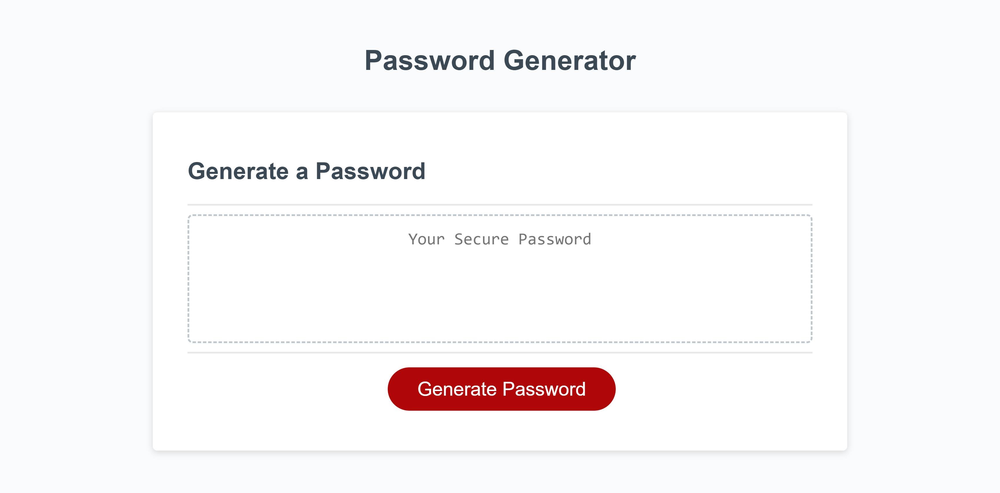

# Module 3 Challenge

## Description

This week we were tasked with creating a functioning password generator. The generator had specific inputs for preferred  password criteria including; length, lowercase characters, uppercase characters, numbers, and special characters.

I learned a lot about Javascript in this assignment. Some of the things are learned are;
- Javascript math functions
- how to properly use arrays
- using conditional statements
- using 'if' statements and 'for' loops
- usage of array methods
- how to create and use functions

## Usage

Click [link](https://n8trask.github.io/Module-3-Challenge/) to visit the functional password generator

